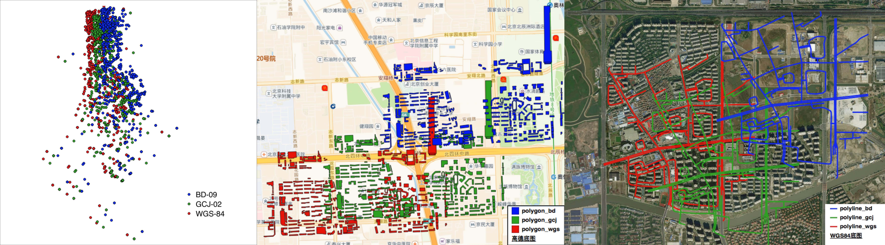

# China Coordinate Convertor


[中国火星坐标](https://en.wikipedia.org/wiki/Restrictions_on_geographic_data_in_China)转换命令行工具，用于`WGS-84`(未偏移坐标), `GCJ-02`（国家测绘局、高德、谷歌中国地图）, `BD-09`(百度坐标系)三者之间的互相转换，支持文件格式：
- ESRI Shapefile
- GeoJSON

  

## install
推荐使用：
`pip install coord-convert`

或者也可以从源码安装：
```
git clone https://github.com/sshuair/coord-convert.git
pip install -r requirements.txt
python setup.py install
```


## 使用方法
```
convert input china coordinate to another. 
    
    Arguments:
        convert_type {string} -- [coordinate convert type, e.g. wgs2bd]

            wgs2gcj : convert WGS-84 to GCJ-02
            wgs2bd  : convert WGS-84 to DB-09
            gcj2wgs : convert GCJ-02 to WGS-84
            gcj2bd  : convert GCJ-02 to BD-09
            bd2wgs  : convert BD-09 to WGS-84
            bd2gcj  : convert BD-09 to GCJ-02

        src_path {string} -- [source file path]
        dst_path {string} -- [destination file path]


    Example:
        coord_covert wgs2gcj ./test/data/line/multi-polygon.shp ~/temp/qqqq.shp 

```


