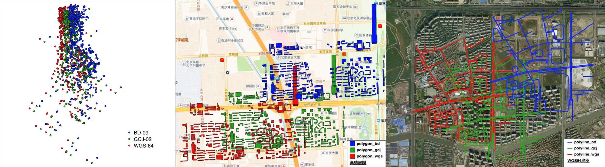

# China Coordinate Convertor

[](https://github.com/sshuair/coord-convert/actions)
[](https://github.com/sshuair/coord-convert/stargazers)
[](https://github.com/sshuair/coord-convert/network)
[](https://github.com/sshuair/coord-convert/blob/master/LICENSE)

[中国火星坐标](https://en.wikipedia.org/wiki/Restrictions_on_geographic_data_in_China)转换命令行工具，用于`WGS-84`(未偏移坐标), `GCJ-02`（国家测绘局、高德、谷歌中国地图）, `BD-09`(百度坐标系)三者之间的互相转换，支持文件格式：
- ESRI Shapefile
- GeoJSON

  

## 安装
推荐使用：
`pip install coord-convert`

或者也可以从源码安装：
```
git clone https://github.com/sshuair/coord-convert.git
pip install -r requirements.txt
python setup.py install
```

## 依赖
- python3
- fiona
- tqdm
- click

## 使用方法
>注意：火星坐标转换是针对经纬度的转换，因此在进行转换前需要将坐标转换成经纬度；比如web墨卡托(3857)等投影坐标系需要先转成经纬度坐标(4326)

### Python API调用
在python程序中调用相应的坐标转换接口

```python
from coord_convert.transform import wgs2gcj, wgs2bd, gcj2wgs, gcj2bd, bd2wgs, bd2gcj 
lon, lat = 120, 40
gcj_lon, gcj_lat = wgs2gcj(lon, lat)
bd_lon, bd_lat = wgs2bd(lon, lat)
print(gcj_lon, gcj_lat) # the result should be: 120.00567568355486 40.0013047896019

```


### 命令行调用
火星坐标转换还支持命令行直接对shp、geojson等文件进行转换，比如

```bash
~/temp > coord_covert gcj2wgs tests/data/Polyline/polyline.geojson aa.geojson
100%|██████████████████████████████████████████████████████| 219/219 [00:00<00:00, 550.93it/s]
```

更详细的用法：
```
convert input china coordinate to another. 
    
    Arguments:
        convert_type {string} -- [coordinate convert type, e.g. wgs2bd]

            wgs2gcj : convert WGS-84 to GCJ-02
            wgs2bd  : convert WGS-84 to DB-09
            gcj2wgs : convert GCJ-02 to WGS-84
            gcj2bd  : convert GCJ-02 to BD-09
            bd2wgs  : convert BD-09 to WGS-84
            bd2gcj  : convert BD-09 to GCJ-02

        src_path {string} -- [source file path]
        dst_path {string} -- [destination file path]


    Example:
        coord_covert wgs2gcj ./tests/data/polygon/polygon_wgs.shp ~/temp/polygon_gcj.shp 

```
